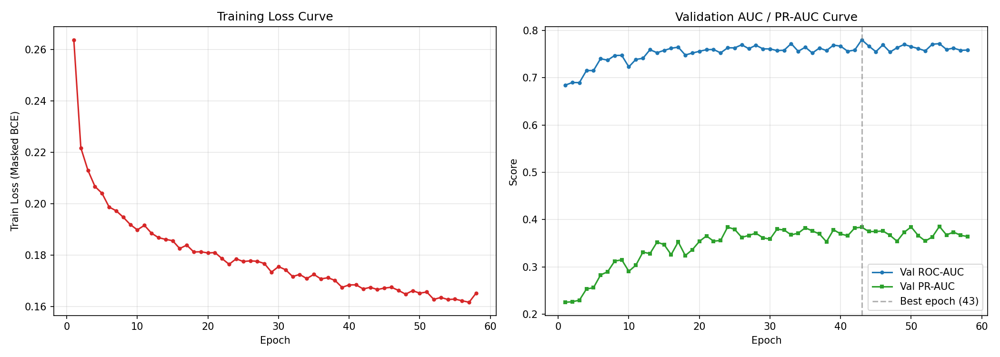
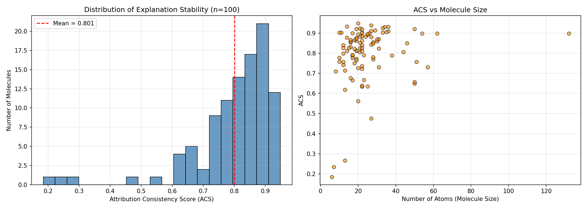
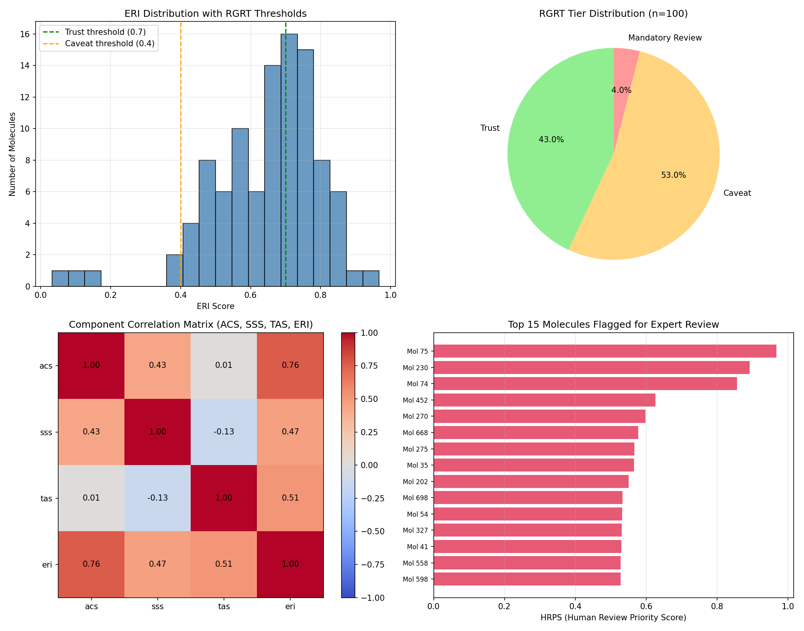
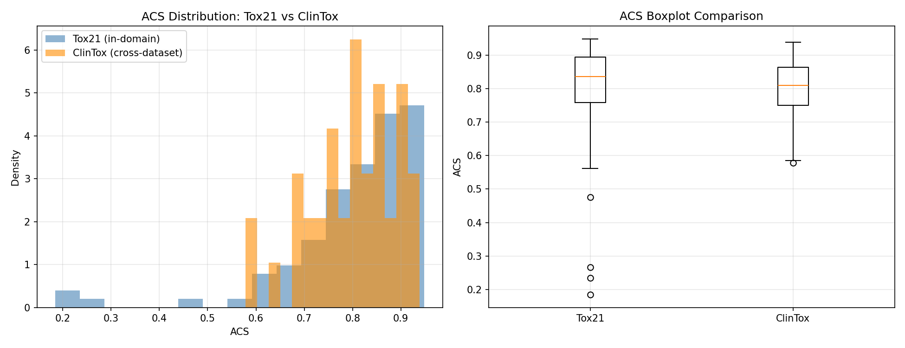

# TXGNN-StaR

### Stability-Aware GNN Framework with Reliability-Quantified Toxicophore Discovery for Trustworthy Molecular Toxicity Prediction


UG Research Fellowship Project — Thapar Institute of Engineering & Technology, Patiala

**Authors:** Savree Dohar (102317097) · Yashika Sharma (102317089)
**Mentor:** Dr. Vijay Kumari, Assistant Professor, Department of Computer Science and Engineering

---

## Table of Contents

- [Overview](#overview)
- [Key Results](#key-results)
- [Repository Structure](#repository-structure)
- [Methodology Summary](#methodology-summary)
- [How to Run](#how-to-run)
- [Limitations & Honest Caveats](#limitations--honest-caveats)
- [References](#references)

---

## Overview

Graph Neural Networks (GNNs) are the leading approach for predicting molecular toxicity from chemical structure, but two problems limit their real-world use: explanations can flip entirely under chemically meaningless perturbations, and there is no signal telling a chemist whether a given explanation can be trusted.

TXGNN-StaR addresses both problems with three components built on top of a standard GAT toxicity classifier:

- **PBES** (Perturbation-Based Explanation Stability): measures how consistent an explanation stays across K=10 graph-isomorphic variants of the same molecule, using mean pairwise Spearman rank correlation (Attribution Consistency Score, ACS).
- **ERI** (Explanation Reliability Index): a single score combining explanation stability (ACS), sparsity (Structural Sparsity Score, SSS — Gini coefficient of atom attributions), and chemical-domain agreement (Toxicophore Agreement Score, TAS — overlap with known structural alerts).
- **RGRT** (Reliability-Guided Review Trigger): classifies each prediction into Trust / Caveat / Mandatory Review tiers based on ERI, with a Human Review Priority Score (HRPS = 1 − ERI) for triaging expert review.

## Key Results

| Metric | Value |
|---|---|
| Base GAT test ROC-AUC (Tox21, 12 endpoints) | **0.7771** |
| Base GAT test PR-AUC | 0.3517 |
| Mean Attribution Consistency Score (ACS), n=100 | **0.801 ± 0.137** |
| Molecules with high explanation stability (ACS ≥ 0.7) | 86% |
| Mean Explanation Reliability Index (ERI) | 0.647 ± 0.159 |
| RGRT tier distribution | Trust 43% · Caveat 53% · Mandatory Review 4% |
| ACS vs TAS correlation (independence check) | r = 0.013, p = 0.94 (not significant) |
| Cross-dataset generalization (Tox21 vs ClinTox ACS) | p = 0.34 (no significant difference) |

> **Key finding** — Explanation stability (ACS) and chemical-domain agreement (TAS) are statistically independent (r ≈ 0.01). A stable explanation is not necessarily a chemically valid one: these are distinct reliability dimensions, which is why ERI combines both rather than relying on either alone.

> **Generalization finding** — PBES produces statistically indistinguishable stability distributions on Tox21 (in-domain) and ClinTox (cross-dataset), suggesting the metric is not a dataset-specific artifact.

### Visual Results

**GAT Training Curves**



**Explanation Stability (ACS) Distribution — 100 Tox21 Molecules**



**ERI Distribution, RGRT Tiers, and Component Correlations**



**Cross-Dataset Validation — Tox21 vs ClinTox**



---

## Repository Structure

```
TXGNN-StaR/
├── README.md
├── requirements.txt
├── LICENSE
├── .gitignore
├── __notebook_source__.ipynb     # Full pipeline: data -> GAT -> PBES -> ERI -> RGRT -> validation
├── best_gat_model.pt             # Trained GAT checkpoint (see Note below on large files)
├── FINAL_PROJECT_SUMMARY.json    # Consolidated metrics across all components
├── training_curves.png           # GAT training loss / validation AUC curves
├── pbes_distribution.png         # ACS distribution across 100 Tox21 molecules
├── eri_rgrt_summary.png          # ERI distribution, RGRT tiers, correlation heatmap
└── clintox_cross_validation.png  # Tox21 vs ClinTox ACS comparison
```

---

## Methodology Summary

1. **Data & graphs:** Tox21 (7,823 valid molecules, 12 toxicity endpoints) and ClinTox (1,480 molecules) converted from SMILES to molecular graphs via RDKit, with Bemis–Murcko scaffold splitting (80/10/10) to prevent structural leakage between train/val/test.
2. **Base model:** 5-layer, 8-head Graph Attention Network (GAT) in PyTorch Geometric, trained with masked BCE loss (to handle Tox21's missing assay labels) and early stopping on validation ROC-AUC.
3. **PBES:** for each molecule, K=10 chemically-equivalent atom-relabelings are generated (graph-isomorphism preserving), GNNExplainer is run on each, and attributions are realigned to the original atom ordering before computing mean pairwise Spearman correlation (ACS).
4. **SSS:** Gini coefficient of the atom attribution distribution on the original (non-perturbed) molecule.
5. **TAS:** overlap between the top-25% most important atoms (per the model's explanation) and atoms matched by a curated set of 30 structural alert SMARTS patterns (Kazius et al., 2005, consistent with the ToxAlerts framework).
6. **ERI:** ERI(G) = α·ACS(G) + β·SSS(G) + γ·TAS(G), with α=0.5, β=0.2, γ=0.3; weights are re-normalized over available components when TAS is undefined (no known alert present in the molecule).
7. **RGRT:** Trust (ERI ≥ 0.7) / Caveat (0.4 ≤ ERI < 0.7) / Mandatory Review (ERI < 0.4), with HRPS = 1 − ERI for review queue prioritization.

---

## How to Run

This project was developed and tested on Kaggle with a T4 GPU. To reproduce:

1. Open `__notebook_source__.ipynb` in a GPU-enabled environment (Kaggle, Colab, or local CUDA machine).
2. Install dependencies: `pip install -r requirements.txt`
3. Run cells sequentially. The notebook downloads Tox21 and ClinTox automatically from the DeepChem S3 bucket.
4. Total runtime: GAT training ~10-15 min; full PBES+SSS+TAS batch over 100 molecules ~1 hour (GNNExplainer optimization is the main bottleneck — each molecule requires 10 separate explainer runs for PBES).

---

## Limitations & Honest Caveats

- TAS uses a curated set of 30 well-known structural alerts (Kazius et al., 2005) rather than the full live ToxAlerts database, since the latter requires external API/network access not available in this environment. This is a representative, literature-grounded subset, not the complete ToxAlerts catalogue.
- 64% of the Tox21 sample and 62.5% of the ClinTox sample contained no matching structural alert, so TAS is only defined for a subset of molecules; ERI re-normalizes weights for the remainder.
- PBES/ERI/RGRT were evaluated on a sample of 100 (Tox21) and 40 (ClinTox) molecules rather than the full test sets, due to the computational cost of running GNNExplainer 10 times per molecule.
- The ACS-TAS independence finding (r≈0.01) is based on only 36 Tox21 molecules with a defined TAS — a larger structural alert set or larger sample would strengthen this result.

---

## References

- Wu, Z. et al. (2018). MoleculeNet: A Benchmark for Molecular Machine Learning.
- Hu, W. et al. (2020). Strategies for Pre-training Graph Neural Networks. ICLR.
- Wu, J. et al. (2023). Substructure Mask Explanation for Graph Neural Networks. Nature Communications.
- Agarwal, C. et al. (2023). Evaluating Explainability for Graph Neural Networks. Scientific Data.
- Li, Y. et al. (2024). On the Stability of GNN Explanations. ICML.
- Kazius, J., McGuire, R., & Bursi, R. (2005). Derivation and Validation of Toxicophores for Mutagenicity Prediction. Journal of Medicinal Chemistry.
- Sushko, I. et al. (2012). ToxAlerts: A Web Server of Structural Alerts for Toxic Chemicals. JCIM.
